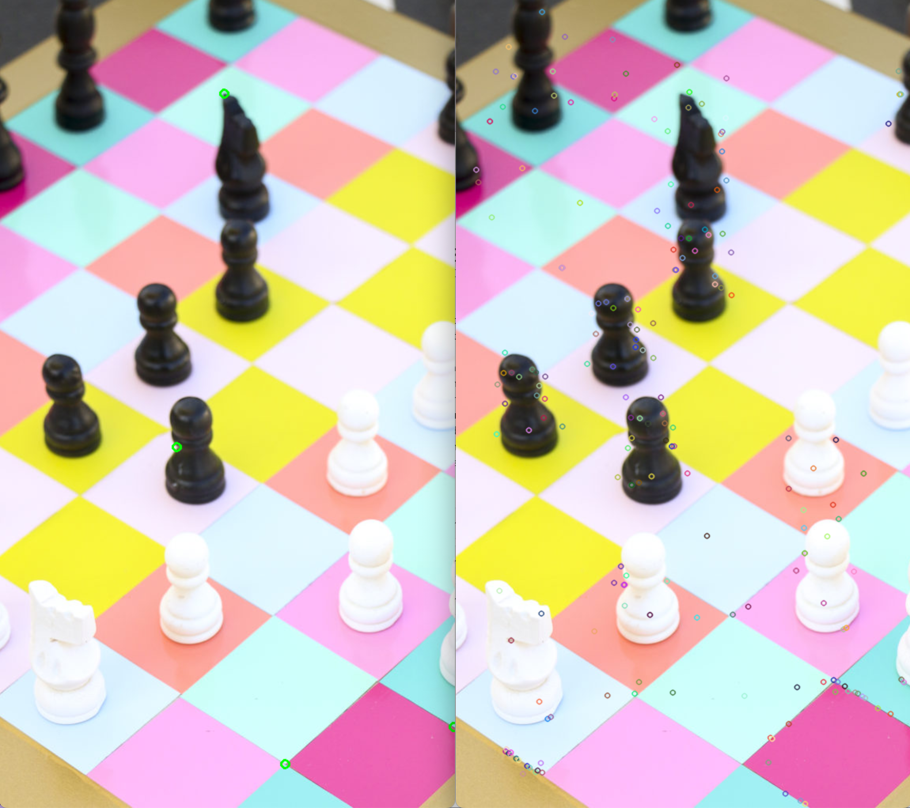
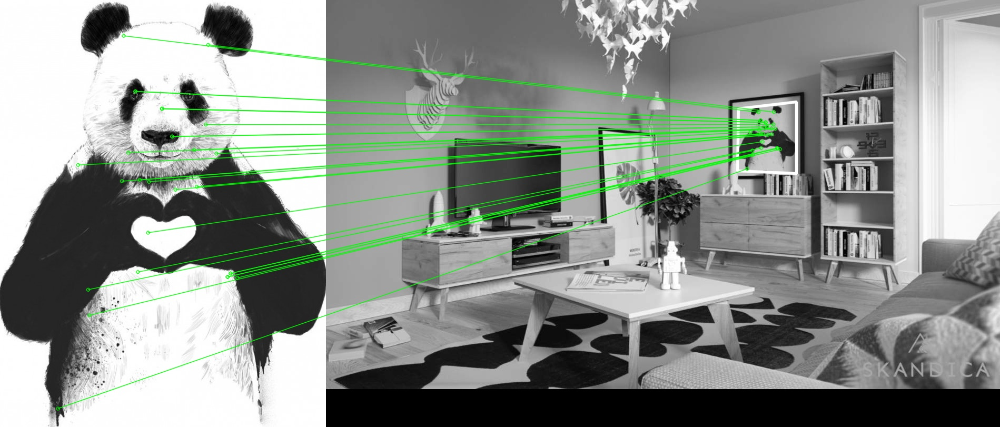
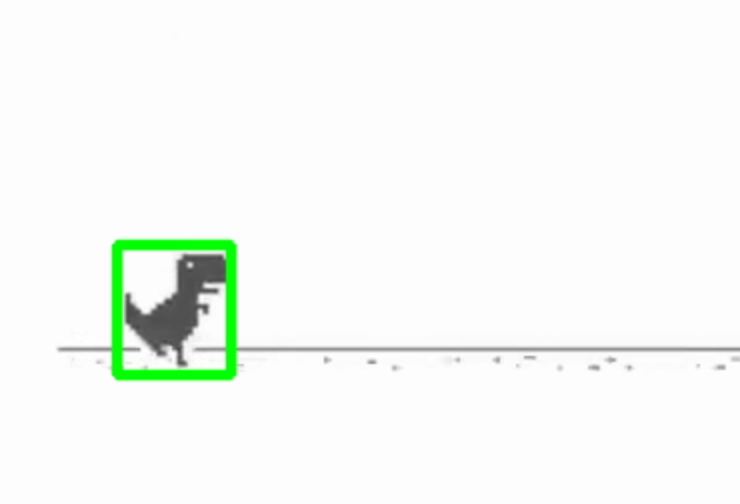

# Image Processing and Feature Detection Project

This project involves three separate programs that perform various image processing and feature detection tasks using OpenCV. The tasks include Harris Corner Detection, SIFT Key Point Detection, Image Matching with Homography, and Object Tracking in Video.

## Table of Contents

- [Introduction](#introduction)
- [Requirements](#requirements)
- [Usage](#usage)
- [Results](#results)
- [File Description](#file-description)

## Introduction

This project contains three programs that perform the following tasks:
1. Harris Corner Detection and SIFT Key Point Detection
2. Image Matching and Homography Calculation
3. Object Tracking in Video

## Requirements

- Python 3.x
- OpenCV (`cv2`)
- NumPy (`numpy`)

You can install the required packages using the following command:
```bash
pip install opencv-python-headless numpy
```
## Usage

To run the scripts, use the following commands:
```bash
python program1.py
python program2.py
python program3.py
```

## Results

### Program 1: Harris Corner Detection and SIFT Key Point Detection
This program detects the top 4 Harris corners and SIFT key points in an image.



### Program 2: Image Matching and Homography Calculation
This program matches features between two images using SIFT and calculates the homography to highlight the matching region.



### Program 3: Object Tracking in Video
This program tracks an object in a video based on feature matching with a reference image.



## File Description

### `program1.py`
This script contains the main logic for Harris Corner Detection and SIFT Key Point Detection. It loads an image, detects the corners and key points, and visualizes the results.

### `program2.py`
This script matches features between a query image and a training image using SIFT and calculates the homography to highlight the detected region in the training image.

### `program3.py`
This script performs object tracking in a video based on feature matching with a reference image. It uses SIFT for feature detection and FLANN for feature matching, followed by a tracking algorithm.


